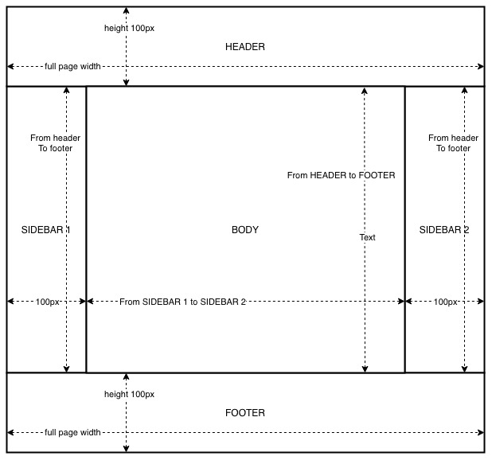

# Exam project

## Main goals
Create a layout for `index.html` which have the following schema. 

## Requirements
- HEADER and FOOTER to be:
    - with equal height of 100px
    - with full page width
- SIDEBAR 1 and SIDEBAR 2 to be:
    - with equal width of 100px
    - with height from HEADER to FOOTER
- BODY to be:
    - with background pattern `assets/img/bg.jpg`
    - with height from HEADER to FOOTER
    - width from SIDEBAR 1 to SIDEBAR 2

## Specific requirements
- if there is nothing in the BODY the layout should be with full page height. The FOOTER will be on the bottom of the page and the BODY will not be scrollable.
- if there is more content inside the BODY the entire page gets scrollable as usual and the FOOTER will be visible when the page is scrolled at the bottom.

## What yo use to achieve your goal?
WHATEVER you like!
You may use:
- S(a|c)ss
- Vanilla JavaScript
- jQuery
- React.js
- Vue.js
- Angular.js
- CSS
- Gulp
- Webpack
- ...

Pretty much it's up to you.

## Hint
There is no "right" or "wrong" solution here. Just do whatever you think is proper solution.
Extra points for optimizing the `assets/img/bg.jpg` for web.
